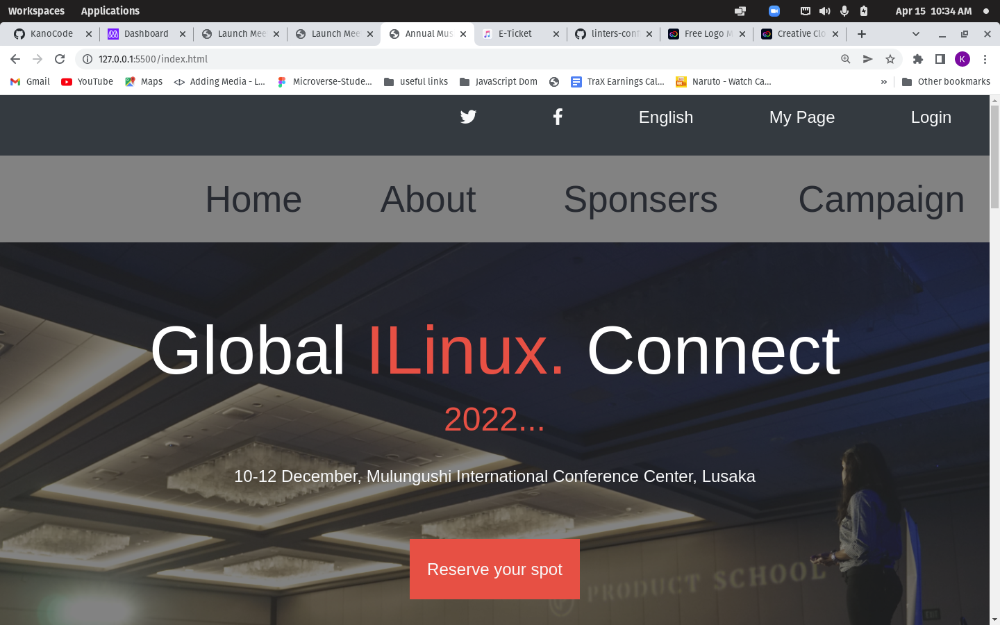

# Annual-Linux-conference-webpage

> A webpage for a fictional annual conference where leading tech enthusiasts from all around the world gather to discuss the future of computing powered by linux.

## Live Demo

[See a Live Demo Here](https://kanocode.github.io/Music-conference-webpage/)

## Built With

- HTML
- CSS
- SASS
- BOOTSTRAP
## Getting Started

To get a local copy up and running follow these simple example steps.
-fork this repostory
-clone it to your local machine
-make changes

## Author

👤 **KanoCode**

- GitHub: [@KanoCode](https://github.com/KanoCode)
- Twitter: [@Kanombola_s](https://twitter.com/Kanombola_s)
- LinkedIn: [LinkedIn](https://www.linkedin.com/in/kanombola-kanombola-a38b061a4/)

## 🤝 Contributing

Contributions, issues, and feature requests are welcome!

Feel free to check the [issues page](../../issues/).

## Acknowledgments

- Hat tip to anyone whose code was used
- Design inspiration: [Cindy Shin from behance.net](https://www.behance.net/adagio07)

## Show your support

Give a ⭐️ if you like this project!

## 📝 License

This project is [MIT](./MIT.md) licensed.
